# TaskFlow

Aplicación móvil de productividad para gestionar tareas, construida con React Native y Expo.
Cada persona tiene su cuenta, sus tareas viven en la nube y su perfil incluye una foto elegida
desde la galería del teléfono.

## App publicada

**Página de la compilación en EAS**, con su código QR:
https://expo.dev/accounts/dranthonymarte/projects/taskflow-app/builds/6335f36c-8e32-4c39-a163-f29bac8172a0

**Descarga directa del instalador** (`.apk`, 64 MB):
https://expo.dev/artifacts/eas/luBJeWVrYtpoxnGgPF9mN2SwZw3eRZ4_WVDN7YP3Nz4.apk

El primer enlace es la página oficial de la compilación. El segundo es el archivo en sí, y es
el camino más corto para probar la app: al escanear el QR desde un teléfono, Expo puede ofrecer
instalar su aplicación auxiliar antes de permitir la descarga, y el enlace directo evita ese
paso intermedio.

La app también se puede ejecutar en Expo Go siguiendo los pasos de instalación de más abajo.

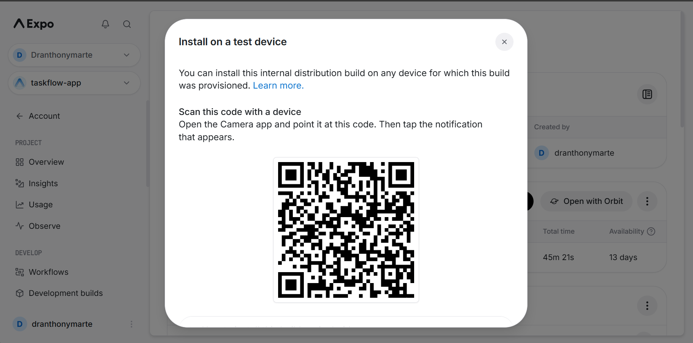

## Evidencia visual

### Flujo de autenticación

| Registro | Inicio de sesión | Credenciales inválidas |
|---|---|---|
| 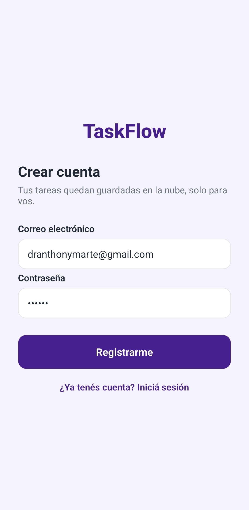 | 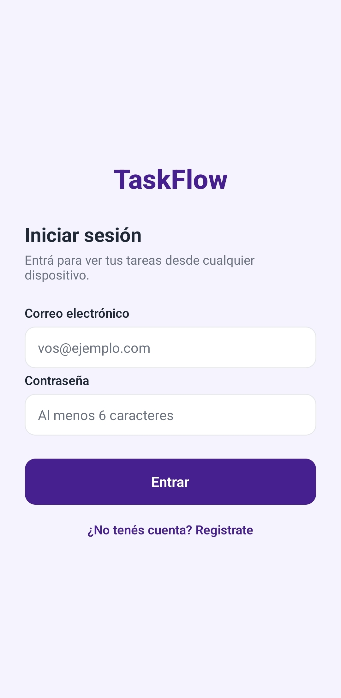 | 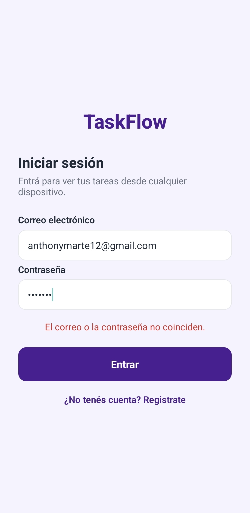 |

### Lista de tareas

| Lista con tareas | Formulario con validación | Confirmación al guardar | Detalle de la tarea |
|---|---|---|---|
| 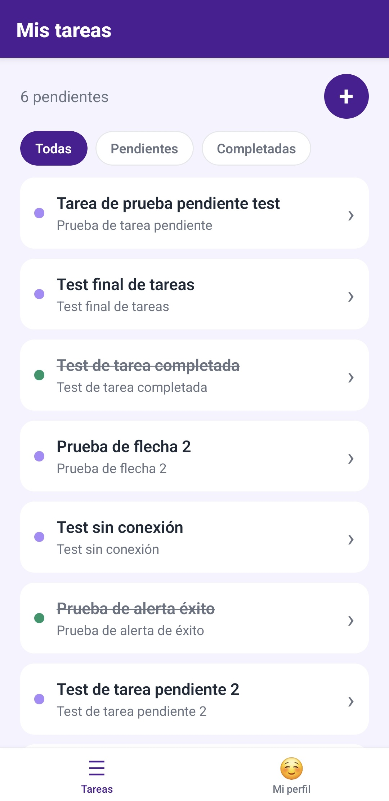 | 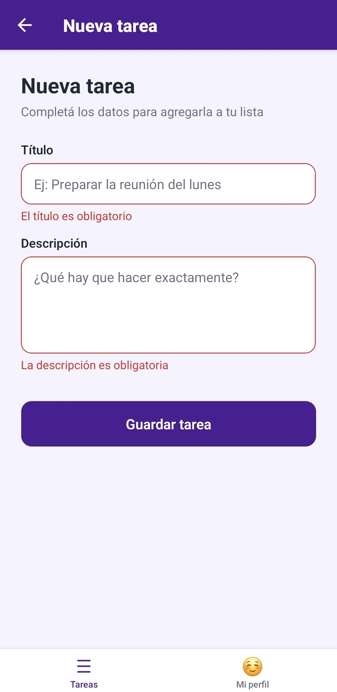 | 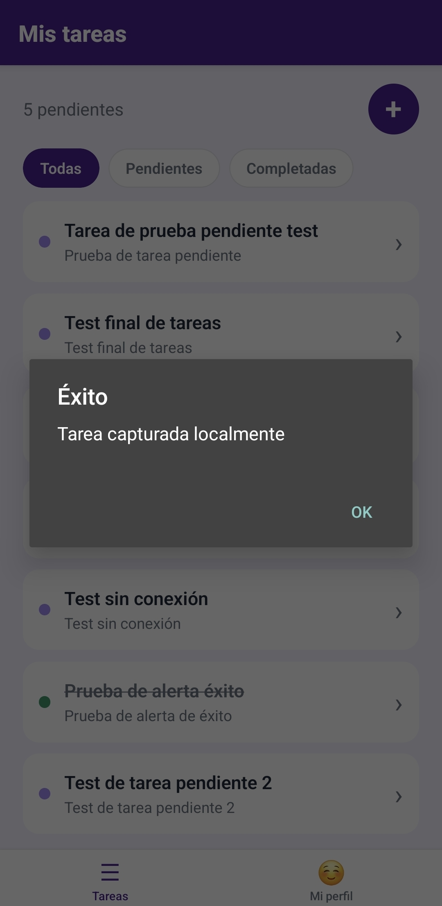 | 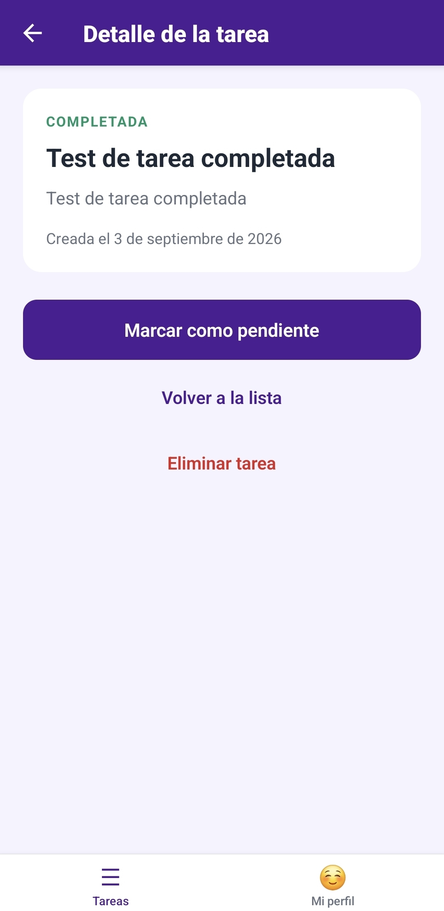 |

### Edición del perfil

| Perfil sin foto | Galería abierta | Se sale sin elegir nada | Perfil con la foto elegida |
|---|---|---|---|
| 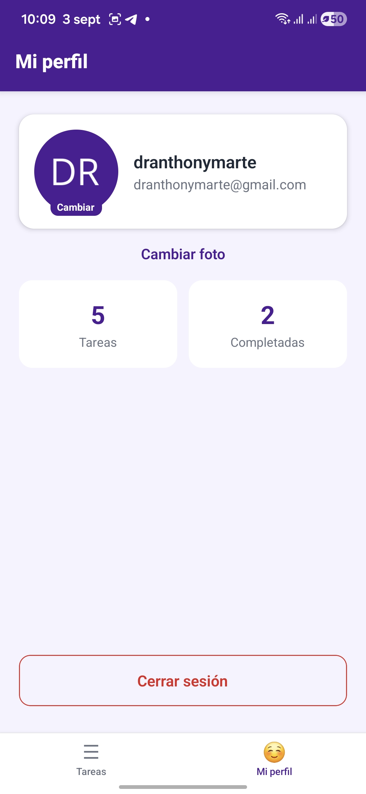 | 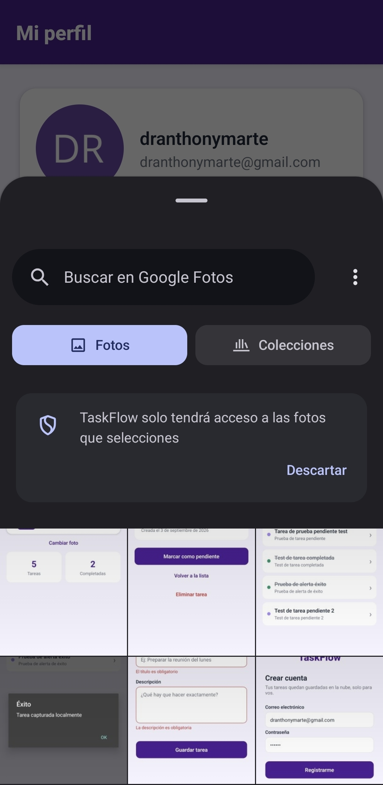 | 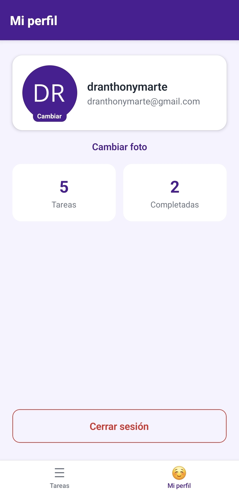 | 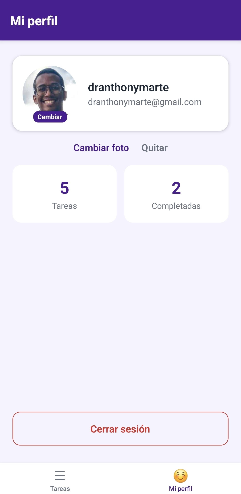 |

La tercera captura es la clave: al salir de la galería sin elegir ninguna imagen, la aplicación
queda **exactamente como estaba**, sin cambios a medias y sin mensajes de error. Recién en la
cuarta, al elegir una foto, el avatar se actualiza.

### Sin conexión

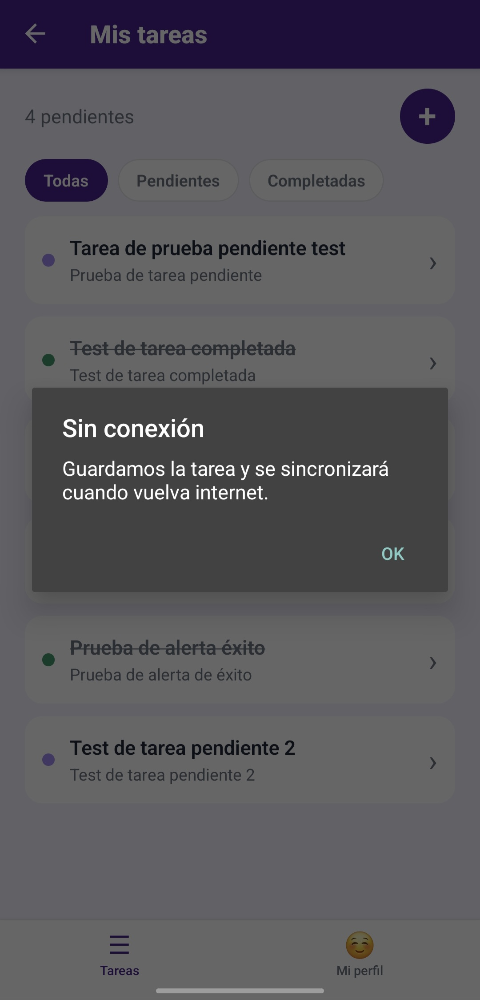

Al guardar una tarea en modo avión, la aplicación no miente diciendo "Éxito": avisa que se
guardó localmente y que se sincronizará sola cuando vuelva internet.

## Requisitos técnicos cumplidos

| Requisito de la consigna | Dónde se cumple |
|---|---|
| **1. Autenticación:** flujo funcional de Login y Registro conectado a Firebase Auth | `src/services/authService.js`, `src/components/AuthForm.js`, `src/screens/LoginScreen.js`, `src/screens/RegisterScreen.js`, `src/hooks/useAuthListener.js` |
| **2. Persistencia:** las tareas se guardan y se leen desde Firestore, asociadas al ID del usuario logueado | `src/services/tasksService.js` (con `where('userId', '==', userId)`), `src/hooks/useTasksSync.js` |
| **3. Estado Global:** Redux Toolkit para gestionar **las tareas y el perfil del usuario** a lo largo de toda la app | `src/store/index.js`, `src/store/tasksSlice.js`, `src/store/authSlice.js` |
| **4. Perfil y Avatar:** pantalla de perfil donde se usa `expo-image-picker` para seleccionar una imagen, que se muestra correctamente en la interfaz | `src/hooks/useAvatarPicker.js`, `src/screens/ProfileScreen.js`, `src/components/ProfileCard.js` |
| **5. Navegación:** Bottom Tabs para las secciones principales y Stack para el login y los detalles | `src/navigation/`: `RootNavigator`, `MainTabsNavigator`, `TasksStackNavigator`, `AuthNavigator` |

### Pasos para la entrega

| Paso | Estado |
|---|---|
| **Limpieza de código:** eliminar `console.log` innecesarios y código muerto | Hecho. No queda ni un `console.log` en `src/`: los errores se muestran en pantalla. Se borraron las pantallas huérfanas de los primeros checkpoints, los estilos sin usar y los imports muertos |
| **Configuración de Firebase:** reglas de seguridad que permitan el acceso solo a usuarios autenticados | Hecho. `firestore.rules` está publicado en la consola, ver la sección de Seguridad |
| **Generación de Build/Link** | Hecho. Build de EAS enlazada arriba |
| **Repositorio con capturas en el README** | Este archivo |

## Criterios de aceptación

Citados textualmente de la consigna, con la explicación de cómo se resuelve cada uno.

> **Integración Funcional:** El estado de Redux debe estar sincronizado con Firestore
> (lectura/escritura).

`useTasksSync` y `useProfileSync` escuchan Firestore con `onSnapshot` y despachan al store; las
pantallas escriben a través de `tasksService` y `profileService`.

> **Flujo de Autenticación Completo:** Login -> App Privada -> Logout -> Login.

`RootNavigator` decide qué árbol de navegación montar según haya sesión o no. Al cerrar sesión
se vacían tanto la lista de tareas como el perfil, para que la próxima cuenta no vea nada de la
anterior.

> **Gestión de Perfil:** La selección de imagen con `ImagePicker` debe funcionar sin errores de
> permisos y persistirse visualmente.

`useAvatarPicker` pide el permiso antes de abrir la galería y distingue el caso de permiso
denegado del de permiso denegado para siempre, que necesita ir a los ajustes del sistema. La
foto se guarda en Firestore, así que sigue ahí después de cerrar y reabrir la aplicación.

> **UI/UX Mobile:** Uso consistente de `StyleSheet`, `SafeAreView` y `FlatList` para asegurar
> que la app se vea bien tanto en iOS como en Android.

Todos los estilos se declaran con `StyleSheet.create`: no hay un solo estilo en línea en el
proyecto. La lista usa `FlatList` con `keyExtractor` y `ListEmptyComponent`. Las seis vistas
usan `SafeAreaView` de `react-native-safe-area-context`, eligiendo los `edges` según la
pantalla: las cuatro orillas en el login, que no tiene encabezado, y solo los laterales en las
pantallas que ya viven dentro del encabezado y la barra de pestañas.

> **Estabilidad:** No debe haber "crashes" al intentar navegar rápidamente o al cancelar la
> selección de una imagen.

Los botones que disparan una escritura quedan deshabilitados mientras la operación está en
curso, lo que evita el doble envío y la doble navegación. La cancelación del selector de
imágenes tiene su propio camino de salida, explicado más abajo.

> **Arquitectura:** Se valorará positivamente el uso de hooks personalizados para la lógica de
> Firebase o Redux.

Cuatro hooks propios, detallados en su sección.

## Instalación y ejecución

1. Instalar las dependencias:

   ```
   npm install
   ```

2. Iniciar el servidor de desarrollo:

   ```
   npx expo start
   ```

3. Escanear el código QR con la app **Expo Go** (App Store / Google Play) para ver la
   aplicación en un teléfono.
4. Entrar con la cuenta de demostración o crear una propia desde la pantalla de registro. El
   correo no necesita ser real: Firebase no lo verifica en este modo.

## Cuenta de demostración

Para probar la app sin tener que registrarse:

| Correo | Contraseña |
|---|---|
| `demo@taskflow.com` | `demo123` |

La cuenta ya tiene tareas cargadas, pendientes y completadas, para poder ver la lista, los
filtros y la pantalla de detalle sin cargar nada a mano.

Es una cuenta compartida, así que su contenido puede variar. Para comprobar el aislamiento
entre usuarios —que cada cuenta ve solo sus propias tareas— conviene registrar una cuenta nueva
con cualquier correo: la lista va a aparecer vacía.

## Hooks personalizados

La lógica de Firebase y de Redux no vive en las pantallas: está en cuatro hooks propios, que es
lo que permite que los componentes se dediquen a mostrar.

| Hook | Qué resuelve |
|---|---|
| `useAuthListener` | Escucha `onAuthStateChanged` y despacha el usuario al store. Es lo que hace que la sesión sobreviva al cierre de la app |
| `useTasksSync` | Suscribe la lista de tareas del usuario a Firestore con `onSnapshot` y devuelve la función de limpieza desde el `useEffect` |
| `useProfileSync` | Lo mismo para el perfil: mantiene el nombre y la foto sincronizados con la colección `usuarios` |
| `useAvatarPicker` | Todo el ciclo del avatar: permisos, apertura de la galería, cancelación, tope de tamaño y guardado en la nube |

Los tres primeros se montan una sola vez, en `RootNavigator`, y devuelven su función de
cancelación para no dejar escuchas colgadas.

## Manejo de errores y cancelación

**Cancelar no es un error.** Cuando alguien abre la galería y se arrepiente, `expo-image-picker`
devuelve `resultado.canceled` en `true`. El hook sale por ahí sin tocar el estado, sin mostrar
mensajes y sin dejar nada a medias:

```js
// Cancelar NO es un error: la persona cambió de idea. Se sale sin tocar
// nada, sin mensaje de error y sin dejar el estado a medio camino.
if (resultado.canceled) {
  return;
}
```

**Primero la pantalla, después la nube.** Al elegir una foto o crear una tarea, el cambio se
despacha a Redux al instante y recién después se espera la confirmación de Firestore. La
interfaz nunca se queda esperando a la red.

**Si la escritura falla de verdad, se deshace.** Cuando Firestore rechaza una operación, la
acción optimista se revierte: la tarea que no se pudo guardar se saca de la lista, la que no se
pudo borrar vuelve a su lugar, y el cambio de estado se alterna de nuevo. La persona se entera
con un aviso y no pierde lo que había escrito.

**Sin conexión no es lo mismo que error.** Firestore no rechaza las escrituras cuando no hay
internet: las encola, y la promesa queda esperando indefinidamente. Por eso toda escritura pasa
por `conTiempoLimite`, en `src/utils/promesas.js`, que corta a los seis segundos. Si se agota el
tiempo la operación **no se revierte** —Firestore la va a subir sola cuando vuelva la red— y el
mensaje lo dice con todas las letras, en vez de mostrar un falso "Éxito".

**Ninguna falla queda solo en la consola.** Si la lectura de tareas falla, aparece un aviso en
la pantalla de la lista y se apaga el indicador de carga, para que no quede girando para
siempre. En todo `src/` no queda un solo `console.log`.

## Seguridad

Las reglas de `firestore.rules` **están publicadas** en la consola de Firebase. Cada tarea solo
la puede leer, modificar o borrar quien la creó, y cada perfil solo su dueño. Todo lo que no
esté declarado queda prohibido.

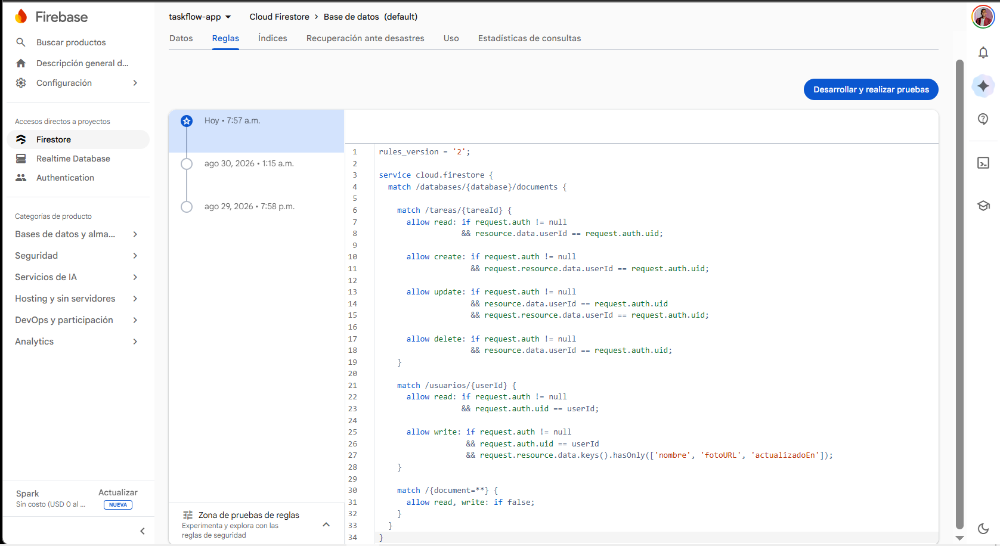

La app también pide **únicamente el permiso que usa**: el de fotos. El plugin de
`expo-image-picker` agrega por defecto los de cámara y micrófono, y los dos están desactivados
explícitamente en `app.json`, porque la aplicación solo abre la galería.

## Sobre las claves de Firebase

El objeto `firebaseConfig` de `src/services/firebase.js` está en el repositorio a propósito. No
es información secreta: identifica al proyecto y viaja dentro de cualquier app publicada, donde
cualquiera puede leerlo. Lo que protege los datos son las reglas de seguridad, no ese archivo.
Gracias a eso el proyecto funciona apenas se clona, sin pasos de configuración.

En `src/services/firebaseConfig.example.js` está la plantilla, por si se quiere apuntar la app a
otro proyecto de Firebase.

## Estructura del proyecto

```
taskflow-app/
├── App.js                        # Provider de Redux + navegador raíz
├── app.json                      # Configuración de Expo y del plugin de imágenes
├── eas.json                      # Perfiles de compilación de EAS
├── firestore.rules               # Reglas de seguridad publicadas
├── capturas/                     # Evidencia visual de este README
├── src/
│   ├── services/
│   │   ├── firebase.js            # Inicialización de Firebase, Auth y Firestore
│   │   ├── firebaseConfig.example.js  # Plantilla de configuración
│   │   ├── authService.js         # Registro, inicio y cierre de sesión
│   │   ├── tasksService.js        # Lectura en vivo y escritura de tareas
│   │   └── profileService.js      # Lectura y escritura del perfil
│   ├── hooks/
│   │   ├── useAuthListener.js     # Escucha el estado de la sesión
│   │   ├── useTasksSync.js        # Sincroniza las tareas del usuario
│   │   ├── useProfileSync.js      # Sincroniza el perfil del usuario
│   │   └── useAvatarPicker.js     # Selección, cancelación y guardado del avatar
│   ├── store/
│   │   ├── index.js               # configureStore
│   │   ├── tasksSlice.js          # Tareas, filtro, carga y error
│   │   └── authSlice.js           # Sesión y perfil (nombre y foto)
│   ├── navigation/
│   │   ├── RootNavigator.js       # Decide entre login y app según la sesión
│   │   ├── AuthNavigator.js       # Stack de login y registro
│   │   ├── MainTabsNavigator.js   # Pestañas Tareas y Perfil
│   │   └── TasksStackNavigator.js # Stack anidado de la pestaña Tareas
│   ├── components/
│   │   ├── AuthForm.js            # Formulario compartido de login y registro
│   │   ├── ProfileCard.js         # Tarjeta de perfil con el avatar pulsable
│   │   ├── TaskItem.js            # Fila de la lista de tareas
│   │   ├── TaskFilters.js         # Chips de filtrado conectados al store
│   │   └── EmptyState.js          # Mensaje cuando no hay tareas
│   ├── screens/
│   │   ├── LoginScreen.js         # Inicio de sesión
│   │   ├── RegisterScreen.js      # Creación de cuenta
│   │   ├── TaskListScreen.js      # Lista con FlatList, filtros y estado vacío
│   │   ├── TaskDetailScreen.js    # Detalle, recibe el id por route.params
│   │   ├── AddTaskScreen.js       # Formulario controlado con validación
│   │   └── ProfileScreen.js       # Perfil: avatar, datos y cierre de sesión
│   ├── constants/
│   │   └── colors.js              # Paleta de colores de TaskFlow
│   └── utils/
│       └── promesas.js            # Límite de tiempo para las escrituras
└── assets/                        # Íconos generados por Expo
```

## Dependencias principales

| Paquete | Para qué se usa |
|---|---|
| `expo` / `react-native` | Base del proyecto (Managed Workflow, SDK 54) |
| `firebase` | Authentication y Firestore (SDK Web, el compatible con Expo Go) |
| `@react-native-async-storage/async-storage` | Guarda la sesión entre arranques de la app |
| `@reduxjs/toolkit` | Store global, `configureStore` y `createSlice` |
| `react-redux` | Hooks `useSelector` y `useDispatch` en las pantallas |
| `expo-image-picker` | Selección de la foto de perfil desde la galería |
| `@react-navigation/native` | Contenedor de navegación |
| `@react-navigation/native-stack` | Stacks de login y de tareas |
| `@react-navigation/bottom-tabs` | Pestañas inferiores |
| `react-native-screens` · `react-native-safe-area-context` | Requisitos nativos de React Navigation |
| `react-native-web` · `react-dom` | Compilación de la versión web |

## Avance por módulo

El proyecto se construyó de forma incremental: cada módulo del curso dejó su propio punto
marcado en el historial. Esta rama muestra el estado final; para ver el proyecto tal como quedó
al cerrar un módulo puntual, entrar por su enlace.

| Módulo | Entregado | Ver ese punto del proyecto |
|---|---|---|
| 2 | Pantallas iniciales y tarjeta de perfil | [checkpoint-2](https://github.com/Dranthonymarte/taskflow-app/tree/checkpoint-2) |
| 3 | Formulario de nueva tarea con validación | [checkpoint-3](https://github.com/Dranthonymarte/taskflow-app/tree/checkpoint-3) |
| 4 | Lista con FlatList, detalle y estado vacío | [checkpoint-4](https://github.com/Dranthonymarte/taskflow-app/tree/checkpoint-4) |
| 5 | Navegación con pestañas y stack anidado | [checkpoint-5](https://github.com/Dranthonymarte/taskflow-app/tree/checkpoint-5) |
| 6 | Estado global con Redux Toolkit | [checkpoint-6](https://github.com/Dranthonymarte/taskflow-app/tree/checkpoint-6) |
| 7 | Autenticación y persistencia con Firebase | [checkpoint-7](https://github.com/Dranthonymarte/taskflow-app/tree/checkpoint-7) |
| 8 | Avatar, robustez, limpieza y publicación | Esta rama |

Una aclaración sobre el Módulo 4: la consigna proponía alternar entre la lista y el detalle con
un estado `selectedTask`, porque en ese punto todavía no habíamos visto React Navigation. Al
llegar al Módulo 5 ese estado se reemplazó por un Stack real, y la tarea seleccionada pasó a
viajar como `route.params.tareaId`. El comportamiento para quien usa la app es el mismo, pero
resuelto con la herramienta que pedía el módulo siguiente.
